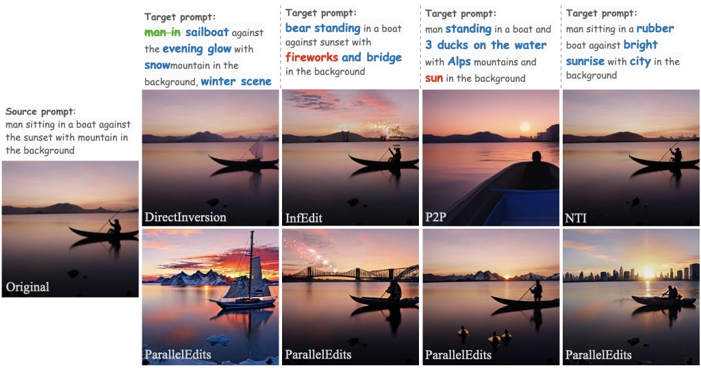

# ParallelEdits

ParallelEdits: Efficient Multi-Aspect Text-Driven Image Editing with Attention Grouping, NeurIPS 2024
[paper](https://arxiv.org/abs/2406.00985)




## Quickstart
### Installation

Our implementation is based on PyTorch and diffusers, the required packages can be installed using

```bash
pip install -r requirements.txt
```

### Demo

We provided a jupyter notebook for this demo. Please refer the Edit_demo.ipynb for examples.